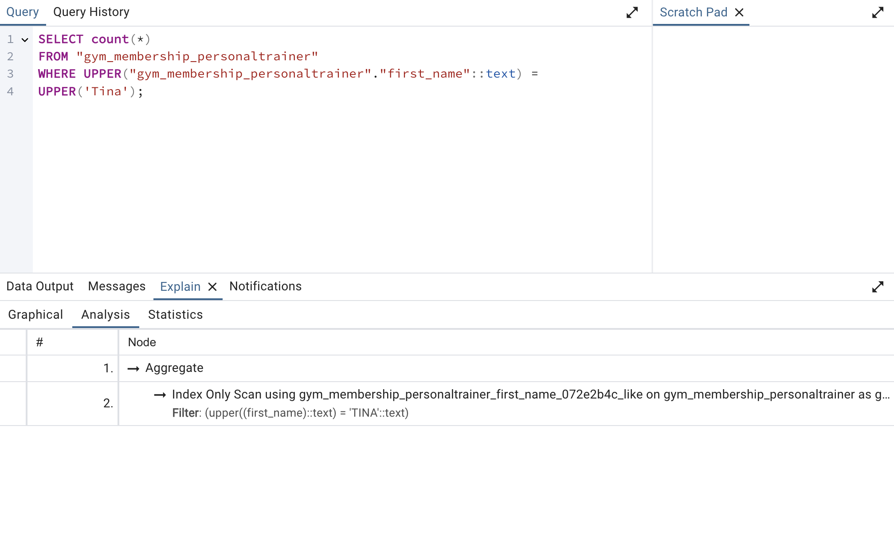
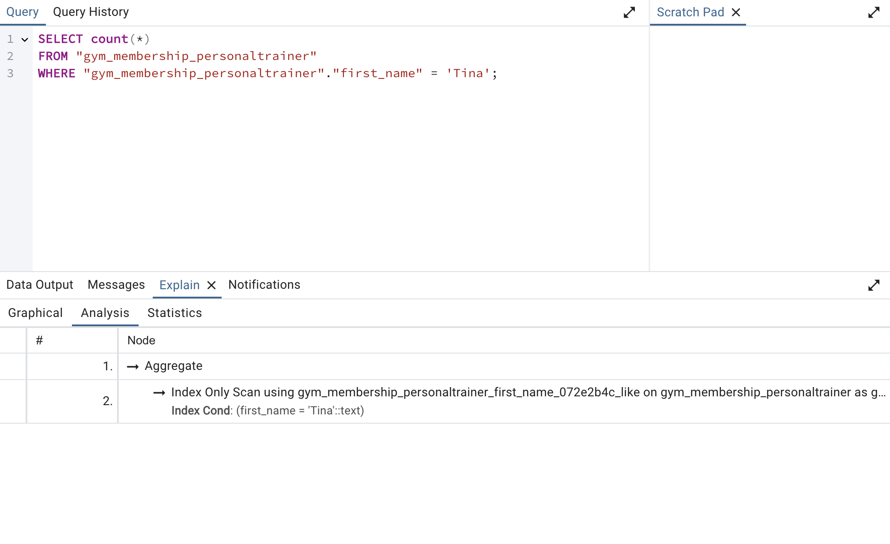

# Use the Index, Django!

## Two Indexes added
- One of the indexes added is a standard index for a varcar column
- The other index added is most likely an index to back a constrant, such as unique.

## The Queiries

### The Query that uses __iexact
```
PersonalTrainer.objects.all().filter(first_name__iexact = "Tina").count()
```



### The Query that does not use __iexact
```
PersonalTrainer.objects.all().filter(first_name = "Tina").count()
```


## Runtime Investigation Results
| Number of Records | Query With Index (s) | Query Without Index (s)  |
|-------------------|----------------------|--------------------------|
| 100               | 0.047                | 0.054                    |
| 1,000             | 0.045                | 0.050                    |
| 10,000            | 0.085                | 0.113                    |
| 100,000           | 0.065                | 1.470                    |


## My Takeaways and Comparison
- When using __iexact, django is unable to use and index because it is doing a case insensitive search which requires it to sift through every row making it a sequential scan/bitmap.
- When not using __iexact, django is able to use the index, and it is significantly faster.
- Case-insensitive searches use sequential scans making them slow and costly on the system.
- A warning to developers when using something like __iexact, is to ensure you only use it when you are willing to do a sequential scan because it will always do one.
- Using the index is much more efficient and with a huge amount of data, sequential scans often take too long to run and can not be used.
- When doing a case sensitive search it will only be faster when doing a case insensitive search if you are using an index or an index only scan.

