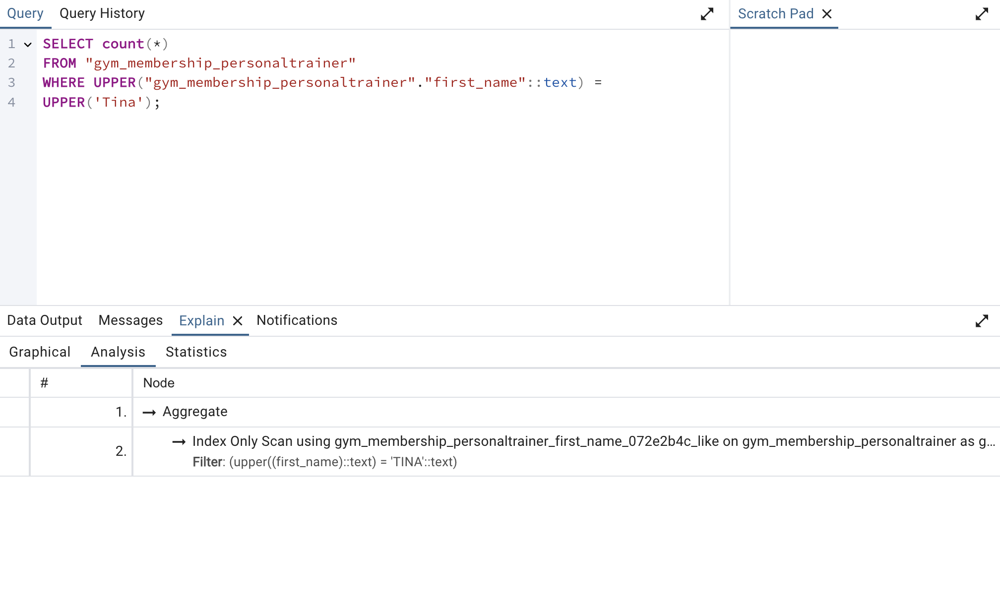
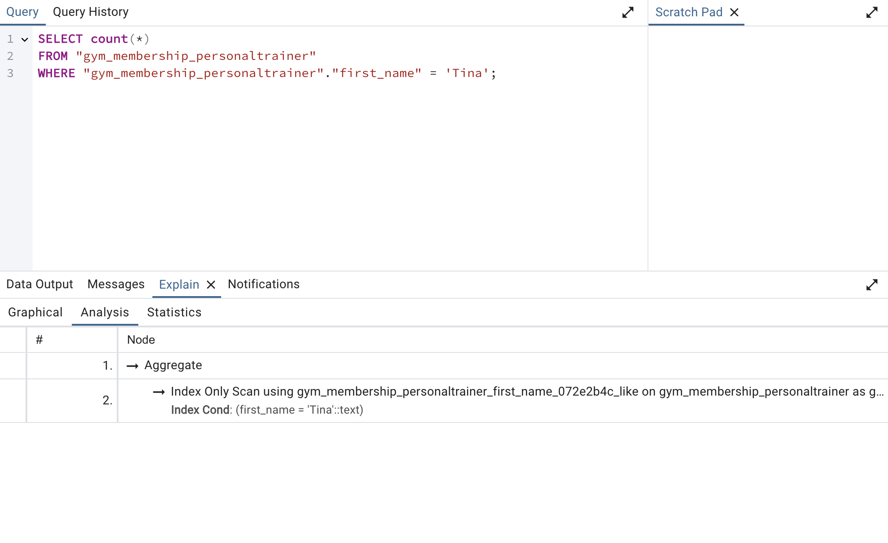

# Use the Index, Django!

## Two Indexes added
- 
- 

## The Queiries

### The Query that uses __iexact
```
PersonalTrainer.objects.all().filter(first_name__iexact = "Tina").count()
```



### The Query that does not use __iexact
```
PersonalTrainer.objects.all().filter(first_name = "Tina").count()
```



## Runtime Investigation Results
| Number of Records | Query With Index (s) | Query Without Index (s)  |
|-------------------|----------------------|--------------------------|
| 100               | 0.047                | 0.054                    |
| 1,000             | 0.045                | 0.050                    |
| 10,000            | 0.085                | 0.113                    |
| 100,000           | 0.065                | 1.470                    |


## My Takeaways